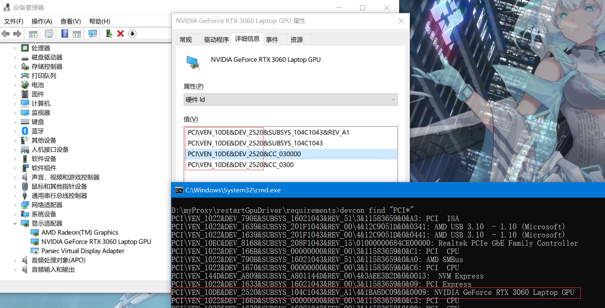
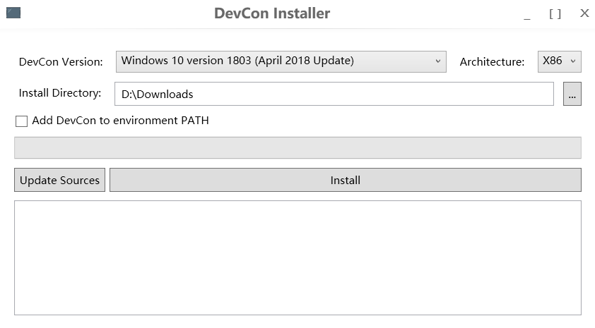

# **笔记本电脑休眠后无视频信号问题解决方案**

#### **现象：**

在使用 Windows 10 家庭版 22H2 系统的 ROG 笔记本电脑时，休眠后恢复桌面时，副屏通过 Type-C 全功能接口连接后没有视频信号，导致无法显示画面。拔掉并重新插入视频线无法恢复显示，且每次电脑休眠后都需要重启系统，十分麻烦。

#### **解决方案：**

**方案1：重启电脑**
此方案通过完全重启计算机来恢复视频信号，但操作繁琐且不高效。

**方案2：重启显卡驱动**
该方案通过重启显卡驱动来恢复副屏视频信号，避免重启计算机的繁琐操作。

#### **优化目标：**

通过编写脚本，自动化重启显卡驱动的操作，从而提高效率，避免每次都需要手动重启电脑。

 Windows 10 家庭版 22H2 系统可直接使用，其他版本没有测试。

[下载restartGpuDriver.zip](/.vitepress/public/logo.png)

[ssss](restartGpuDriver.zip)


/alone-note-public/assets/image-20250111135032031.BaaJe71D.png

#### **实现步骤：**

在 Windows 系统中，`devcon` 工具是设备管理器的命令行接口，能够通过命令行对设备进行管理，包括启用、禁用和重启等操作。可以利用该工具对显卡驱动进行重启。

例如，可以使用以下命令查看所有设备：

```
devcon.exe find "PCI*"
```

0.获取设备ID

硬件 ID 是每个设备的唯一标识符，通过它可以精确定位并操作设备。具体如何获取硬件 ID，可以通过`设备管理器`查看或使用`命令行获取`。



```
设备ID: PCI\VEN_10DE&DEV_2520
```

1 .下载devcon.exe

直接从第三方站点下载适用于你的系统架构的 `devcon.exe`（注意从可信来源下载，避免安全风险）：

下载工具: Devcon Installer.exe

https://github.com/Drawbackz/DevCon-Installer/releases



2.替换requirements目录下的devcon.exe


3.替换restartGPUDriver.bat脚本设备ID名称

```
REM 替换 "PCI\VEN_10DE&DEV_2520*" 为你的硬件 ID, 星号为模糊匹配
set DEVICE_ID="PCI\VEN_10DE&DEV_2520*"
```

4.双击运行restartGPUDriver.bat


>  转发请说明出处

#### 参考

https://chatgpt.com/

https://blog.csdn.net/ynztlan/article/details/140989051

#### **总结：**

通过自动化脚本重启显卡驱动，无需重启计算机即可恢复副屏视频信号，提升使用体验并避免重复操作。